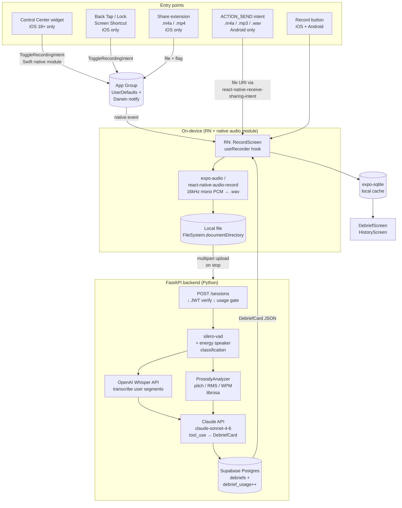

# Mirra — MVP Implementation Plan

## Context

Mirra is a conversational coaching app that analyzes whether the user is a good *conversationalist* in daily life (not a public speaker). The target user struggles with making conversations engaging and doesn't know what they're doing wrong. Mirra records real conversations, analyzes the user's speech for social signals (talk/listen ratio, question frequency, interruptions, energy, vocabulary), and surfaces a debrief card with actionable coaching and an AI-powered Reflect chat grounded in the user's data.

This is a greenfield project — the current repo contains only a `README.md` placeholder.

**Key decisions:**
- **Frontend:** React Native (cross-platform iOS + Android from one TS codebase)
- **Backend:** Python FastAPI proxy (Whisper + Claude live behind it; user never sees API keys; server-side usage enforcement)
- **DB + Auth:** Supabase (Postgres + Auth — Python backend verifies Supabase JWTs)
- **VAD runs server-side** in Python (cross-platform simplicity; on-device VAD would require separate CoreML and TFLite native modules per platform — defer to v2)
- **Android file upload:** Android's `ACTION_SEND` intent system lets the main activity receive audio files directly — no separate extension process. Register `audio/*` MIME type in the manifest and handle the incoming URI via `react-native-receive-sharing-intent`. Ships in Phase 4 alongside Polish.
- **iOS gets extras in a later phase:** Control Center widget, AppIntents (Back Tap / Lock Screen Shortcut trigger), Share extension. Android gets file upload in Phase 4.
- Freemium: 5 debriefs/month free, unlimited paid (subscription out of scope for MVP — usage cap enforced server-side)

---

## Shape of the System



The diagram shows four things that matter for review: (1) on-device the app only captures audio to a local file — no VAD, no streaming; (2) the backend does all heavy lifting in one synchronous pipeline (VAD → Whisper → prosody → Claude → DB write) per session; (3) iOS-only trigger surfaces communicate through App Group IPC into the RN runtime via a custom native module; (4) Android supports uploading existing voice recording files via the system share sheet (`ACTION_SEND` intent) — no separate extension process needed, the main activity handles it directly via `react-native-receive-sharing-intent`.

---

## Tech Stack

| Layer | Choice |
|---|---|
| Mobile app | React Native (bare workflow via Expo with prebuild) + TypeScript |
| Audio capture | `expo-audio` (preferred) or `react-native-audio-recorder-player` if more control needed |
| Local DB | `expo-sqlite` (debrief card cache + history) |
| Networking | `fetch` + `@tanstack/react-query` |
| Auth | Supabase Auth (`@supabase/supabase-js`) — Sign in with Apple + Google |
| Backend | FastAPI (Python 3.11+) |
| Backend deps | `fastapi`, `uvicorn`, `supabase` (py), `openai`, `anthropic`, `silero-vad`, `librosa`, `numpy`, `pydantic` |
| VAD | `silero-vad` (Python package) — runs server-side per request |
| Transcription | OpenAI Whisper API |
| Analysis | Anthropic Claude API, `claude-sonnet-4-6` with `tool_use` for structured output |
| Storage | Supabase Postgres (mirror of all debriefs + usage counters) |
| Backend hosting | Render / Fly.io / Railway (single web service, autoscaling) |

---

## Repo Layout

Monorepo with the app and backend side-by-side:

```
/
├── app/                          (React Native — Expo bare)
│   ├── app.config.ts
│   ├── package.json
│   ├── src/
│   │   ├── screens/
│   │   │   ├── OnboardingScreen.tsx
│   │   │   ├── RecordScreen.tsx
│   │   │   ├── DebriefScreen.tsx
│   │   │   ├── HistoryScreen.tsx
│   │   │   └── SettingsScreen.tsx
│   │   ├── hooks/
│   │   │   ├── useRecorder.ts          — wraps expo-audio, manages session state
│   │   │   ├── useUsage.ts             — fetches monthly count from backend
│   │   │   ├── useAuth.ts              — Supabase auth state
│   │   │   └── useSharedFile.ts        — Android ACTION_SEND intake (react-native-receive-sharing-intent)
│   │   ├── api/
│   │   │   ├── client.ts               — fetch wrapper that attaches Supabase JWT
│   │   │   ├── sessions.ts             — POST /sessions multipart upload
│   │   │   └── debriefs.ts             — GET /debriefs (history sync)
│   │   ├── db/
│   │   │   ├── schema.ts               — expo-sqlite schema
│   │   │   └── debriefRepo.ts          — insert/list debriefs from local cache
│   │   ├── models/
│   │   │   ├── DebriefCard.ts
│   │   │   └── ConversationStats.ts
│   │   ├── nativebridge/
│   │   │   └── ios/
│   │   │       └── MirraTrigger.ts     — NativeEventEmitter for ToggleRecording events
│   │   └── App.tsx
│   └── ios/                            (Expo prebuild output)
│       ├── Mirra/                      (main RN app target)
│       ├── MirraIntents/               (AppIntents extension — Phase 5)
│       ├── MirraWidgets/               (Control Center widget — Phase 5)
│       └── MirraShare/                 (Share extension — Phase 5)
│   └── android/                        (Expo prebuild output)
│
├── backend/                      (FastAPI)
│   ├── pyproject.toml
│   ├── Dockerfile
│   ├── app/
│   │   ├── main.py                     — FastAPI app + middleware
│   │   ├── auth.py                     — Supabase JWT verification dep
│   │   ├── routes/
│   │   │   ├── sessions.py             — POST /sessions
│   │   │   └── debriefs.py             — GET /debriefs
│   │   ├── pipeline/
│   │   │   ├── coordinator.py          — chains vad → whisper → prosody → claude
│   │   │   ├── vad.py                  — silero-vad wrapper + segment extraction
│   │   │   ├── speaker.py              — energy-based user/other heuristic
│   │   │   ├── prosody.py              — librosa pitch/energy/WPM
│   │   │   ├── whisper.py              — OpenAI API client
│   │   │   └── claude.py               — Anthropic API client (tool_use)
│   │   ├── db/
│   │   │   ├── supabase.py             — service-role Supabase client
│   │   │   ├── usage.py                — monthly count read/increment
│   │   │   └── debriefs.py             — persist DebriefCard
│   │   └── models/
│   │       ├── debrief.py              — pydantic DebriefCard, ConversationStats
│   │       └── prosody.py
│   └── tests/
│       ├── test_pipeline.py            — fixture WAV → assert DebriefCard shape
│       └── test_usage_gate.py
│
└── README.md
```

---

## Backend API

All endpoints require a valid Supabase JWT (verified by `app/auth.py` dependency). The middleware extracts `user_id` from the token.

### `POST /sessions`
- Accepts: multipart with `audio` (WAV/M4A, max 25MB) + JSON metadata (`startedAt`, `clientDuration`)
- Gate: fetch `debrief_usage` for current month; reject 402 if user is at free-tier cap
- Pipeline (synchronous, ~10–30s):
  1. `vad.extract_segments(wav)` → `[(start, end, energy)]`
  2. `speaker.classify(segments)` → label each as user/other (energy threshold tuned on top-quartile = user)
  3. `whisper.transcribe(concat_user_segments_with_pads)` → transcript
  4. `prosody.analyze(user_pcm)` → pitch/energy/WPM
  5. `claude.analyze(transcript, prosody, duration)` → `DebriefCard`
  6. Insert into `debriefs` table; increment `debrief_usage`
- Returns: `{ debrief: DebriefCard, usedThisMonth: int, remaining: int }`

### `GET /debriefs`
- Returns: paginated debrief history for the user (used by app on launch to populate local SQLite cache)

### `GET /usage`
- Returns: `{ usedThisMonth, remaining, resetsAt }` — lightweight endpoint app polls on launch

**Supabase DB tables:**
- `users` — managed by Supabase Auth
- `debrief_usage` — `(user_id, month_key UNIQUE WITH user_id, count int)`
- `debriefs` — full debrief records: `(id uuid, user_id, created_at, observation, pattern_to_reduce, thing_to_try_next, stats jsonb, transcript text)`

---

## Phased Build Order

Each phase produces something runnable.

### Phase 0 — Infrastructure (Days 1–3)
- `npx create-expo-app app --template` bare workflow + TS
- `cd backend && uv init` (or `poetry init`); add FastAPI + deps
- Supabase project: enable Auth providers (Apple, Google), create DB schema (`debriefs`, `debrief_usage`)
- `backend/app/auth.py` — Supabase JWT verification dependency
- `backend/app/main.py` — FastAPI app with health check + CORS
- Dockerfile + deploy to Render/Fly (push a "hello" version)
- App: `useAuth` hook + minimal sign-in screen (Sign in with Apple on iOS, Google on Android)
- App: `api/client.ts` attaches JWT to every request
- **Validate:** app signs in on both iOS and Android simulators; `/health` returns 200 with a valid JWT, 401 without.

### Phase 1 — Audio Capture (Days 4–6)
- App: install `expo-audio`; configure `ios.infoPlist.NSMicrophoneUsageDescription` and `android.permissions.RECORD_AUDIO`
- App: `useRecorder` hook — start/stop, write 16kHz mono WAV to `FileSystem.documentDirectory`
- App: `RecordScreen` — minimal idle/recording/processing state UI
- App: configure iOS audio session for background (`UIBackgroundModes: ["audio"]` in app.config.ts) and Android foreground service for long recordings
- **Validate on device:** record 2 minutes on iPhone with screen locked / in pocket; resulting WAV is intact. Same on Android.

### Phase 2 — Backend Pipeline (Days 7–11)
- `backend/app/pipeline/vad.py` — wrap `silero-vad`; extract speech segments with start/end/energy
- `backend/app/pipeline/speaker.py` — energy-percentile heuristic: top quartile = user, rest = other (document limitation: requires user to be closer to mic)
- `backend/app/pipeline/whisper.py` — OpenAI Whisper client; concat user segments with 200ms silence pads
- `backend/app/pipeline/prosody.py` — librosa pitch detection (yin), RMS, estimated WPM from transcript / user duration
- `backend/app/pipeline/claude.py` — Anthropic SDK call with `tool_use` for structured `DebriefCard` output (2-retry on schema mismatch). Implement prompt caching on the system prompt + tool definition.
- `backend/app/pipeline/coordinator.py` — orchestrates the chain
- `backend/app/routes/sessions.py` — `POST /sessions` wires multipart upload → pipeline → DB write → response
- `backend/tests/test_pipeline.py` — fixture WAV through coordinator, assert DebriefCard JSON shape
- **Validate:** `curl` a 2-minute fixture WAV → confirm pipeline returns valid `DebriefCard` and rows land in Supabase.

### Phase 3 — App ↔ Backend Wiring (Days 12–14)
- App: `api/sessions.ts` — multipart upload of the recorded WAV; show processing overlay while waiting
- App: `db/debriefRepo.ts` — `expo-sqlite` schema; insert returned DebriefCard
- App: `DebriefScreen` — three coaching bullets, stats bar
- App: `HistoryScreen` — list from local SQLite; on launch, `GET /debriefs` to sync
- App: `useUsage` hook — `GET /usage` on launch; `RecordScreen` blocks start if at limit and shows "5/5 used" modal
- **Validate end-to-end:** fresh install → sign in → record 2 min → see debrief card → kill app → relaunch → card still in history → check Supabase dashboard for matching rows.

### Phase 4 — Polish + Beta (Days 15–18)
- Error handling: network failures with retry; Whisper file size limit (chunk if >25MB); Claude decode retry already in Phase 2
- iOS audio-session interruption (phone call) — pause + resume or surface recoverable error
- `OnboardingScreen` — value prop + legal consent gate before first recording
- App icon, launch screen, App Store / Play Store screenshots
- TestFlight build (iOS) + internal track APK (Android)
- **Android file upload via share intent:**
  - Install `react-native-receive-sharing-intent`; add `android.intent.action.SEND` / `audio/*` intent filter to `AndroidManifest.xml` (Expo config plugin or direct edit after prebuild)
  - `src/hooks/useSharedFile.ts` — calls `ReceiveSharingIntent.getReceivedFiles` on mount and on app foreground; extracts the file URI for the first audio item
  - `RecordScreen` (or a new `ImportScreen`) — when a shared file URI is present, show an "Analyze this recording" confirmation card instead of the record button; on confirm, upload the file to `POST /sessions` with `clientDuration` derived from file metadata
  - Guard: validate file is a recognised audio MIME type (`audio/mpeg`, `audio/mp4`, `audio/wav`, `audio/x-m4a`, `audio/ogg`) and under 25MB before upload; surface a friendly error modal otherwise
  - After the intent is consumed, call `ReceiveSharingIntent.clearReceivedFiles()` so a re-launch doesn't re-trigger
  - **Validate on Android device/emulator:** open Files app, long-press a `.m4a`, tap Share → Mirra → confirm confirmation card appears → tap Analyze → confirm DebriefCard appears and row lands in Supabase

### Phase 5 — iOS Extras (Days 19–24) *iOS only*
Requires Expo bare prebuild and manual Xcode work for extension targets.
- Add three targets to `app/ios/`: `MirraIntents` (AppIntents extension), `MirraWidgets` (Control Center widget, iOS 18+), `MirraShare` (Share extension)
- All four targets share App Group: `group.com.<yourname>.mirra`
- `ToggleRecordingIntent.swift` (MirraIntents) — writes a command to shared `UserDefaults`, posts a Darwin notification; `openAppWhenRun = false`
- Native module `MirraTriggerModule.swift` in the main app — `CFNotificationCenter` observer that emits an event into RN via `RCTEventEmitter`
- `src/nativebridge/ios/MirraTrigger.ts` — `NativeEventEmitter` subscription; on event, `useRecorder.toggle()`
- `MirraControlWidget.swift` (MirraWidgets) — `ControlWidgetToggle` backed by `ToggleRecordingIntent`
- `MirraShareViewController.swift` (MirraShare) — accepts `.m4a`/`.mp4`, copies to App Group container, writes pending-import flag; main app polls on foreground and routes to `/sessions`
- **Validate on iOS 18 device:** swipe to Control Center from lock screen, tap widget, confirm recording starts and the mic indicator appears. Share a Voice Memo into Mirra, confirm debrief appears.

---

## Critical Types

```ts
// app/src/models/DebriefCard.ts
export interface DebriefCard {
  id: string;
  sessionId: string;
  createdAt: string; // ISO
  observation: string;
  patternToReduce: string;
  thingToTryNext: string;
  stats: ConversationStats;
}

export interface ConversationStats {
  talkListenRatio: number;
  questionCount: number;
  interruptionCount: number;
  sessionDurationMinutes: number;
  userSpeechDurationMinutes: number;
  estimatedWPM: number;
}
```

```python
# backend/app/models/debrief.py
from pydantic import BaseModel

class ConversationStats(BaseModel):
    talk_listen_ratio: float
    question_count: int
    interruption_count: int
    session_duration_minutes: float
    user_speech_duration_minutes: float
    estimated_wpm: float

class DebriefCard(BaseModel):
    id: str
    session_id: str
    created_at: str
    observation: str
    pattern_to_reduce: str
    thing_to_try_next: str
    stats: ConversationStats
```

Pydantic models serialize to `snake_case` in the API; the RN client converts to `camelCase` at the boundary in `api/client.ts`.

---

## Gotchas to Validate Early

1. **Background recording on Android** — Android requires a foreground service with a persistent notification for long-running mic capture. Expo provides this via config; verify on a real Android device that recording survives screen-off and app backgrounding for 5+ minutes.

2. **iOS background audio** — needs `UIBackgroundModes: ["audio"]` in `app.config.ts` and an active `AVAudioSession` category. Verify recording continues when phone is locked and in pocket.

3. **Claude structured output** — use `tool_use` (not free-text JSON parsing) to guarantee shape. Add 2-retry loop before surfacing error. Validate the prompt + tool schema produce sensible debriefs against 3–5 fixture WAVs before any UI work in Phase 3.

4. **Whisper size limit (25MB)** — a 2-minute WAV at 16kHz mono is ~3.8MB, so MVP is safe. If allowing longer sessions, chunk on the backend at 20-min boundaries.

5. **Speaker classification accuracy** — the energy-percentile heuristic only works when the user is consistently closer to the mic. Document this limitation in onboarding ("works best when the phone is in your pocket or on the table"). Plan for a v2 that uses a dedicated speaker diarization model.

6. **App Group provisioning (Phase 5 only)** — register the App Group identifier in Apple Developer portal and enable it on all four target provisioning profiles before writing any IPC code. Silent failures if mismatched.

7. **Expo prebuild + native extensions** — Phase 5's iOS extension targets are not managed by Expo. They live in `ios/` after `expo prebuild` and must be re-applied if you regenerate native code. Either commit `ios/` and stop running `prebuild`, or write a `withMod` Expo config plugin to inject the targets.

8. **Supabase JWT verification in Python** — use Supabase's JWKS endpoint with `python-jose`. Cache the JWKS for the configured TTL; do not fetch on every request.

9. **Prompt caching on Claude calls** — the system prompt + tool definition are stable across requests. Mark them as `cache_control: ephemeral` so they hit cache after the first call. Track cache hit rate from `usage.cache_read_input_tokens` in Anthropic SDK responses.

---

## Dependencies

### App (`app/package.json`)
| Package | Use |
|---|---|
| `expo`, `expo-router`, `expo-audio`, `expo-sqlite`, `expo-file-system` | Core RN + audio + local DB |
| `@supabase/supabase-js` | Auth (Sign in with Apple / Google) + JWT |
| `@tanstack/react-query` | Async state for `/sessions`, `/debriefs`, `/usage` |
| `react-native-reanimated`, `react-native-svg` | DebriefScreen score animation |
| `react-native-receive-sharing-intent` | Android `ACTION_SEND` audio file intake |

### Backend (`backend/pyproject.toml`)
| Package | Use |
|---|---|
| `fastapi`, `uvicorn[standard]`, `python-multipart` | Web framework + multipart upload |
| `pydantic`, `pydantic-settings` | Models + env config |
| `supabase` | DB client + storage |
| `python-jose[cryptography]` | JWT verification against Supabase JWKS |
| `openai` | Whisper |
| `anthropic` | Claude (`claude-sonnet-4-6` with `tool_use` + prompt caching) |
| `silero-vad` | Server-side VAD |
| `librosa`, `numpy`, `soundfile` | Prosody analysis |
| `pytest`, `httpx` | Tests |

---

## Verification

**End-to-end test (Phase 3 complete):**
1. Fresh install on iOS simulator → sign in with Apple → onboarding → consent
2. Tap record → speak for 2 minutes (mix of questions, monologuing, pauses) → tap stop
3. Confirm processing overlay (~10–30s)
4. Confirm DebriefScreen shows: 3 non-empty coaching bullets, stats with plausible talk/listen ratio and question count
5. Navigate to History → card appears
6. Force-kill, relaunch → card still in History (SQLite persisted) and synced via `GET /debriefs`
7. Repeat on Android (Pixel emulator)
8. Supabase dashboard: `debrief_usage` incremented to 1, `debriefs` row present with the same `id`

**Usage cap test:**
1. Manually set `debrief_usage.count = 5` for the user
2. Attempt to record → confirm gate modal appears, recording does not start, `POST /sessions` is not called

**Backend pipeline test (Phase 2 complete):**
1. `pytest backend/tests/test_pipeline.py` — fixture WAV → asserts DebriefCard fields exist and are within expected ranges
2. `curl -F 'audio=@fixture.wav' -F 'startedAt=...' -H 'Authorization: Bearer <jwt>' https://<host>/sessions` → 200 with DebriefCard JSON

**Android file upload (Phase 4 complete):**
1. On Android emulator or device: open Files / a third-party files app, navigate to a `.m4a` or `.mp3` recording
2. Long-press → Share → select Mirra from the share sheet
3. Confirm the confirmation card appears (not the record button)
4. Tap Analyze → confirm processing overlay → DebriefCard appears
5. Confirm Supabase `debriefs` row present and `debrief_usage` incremented
6. Re-launch app without sharing again → confirm no confirmation card (intent was cleared)
7. Attempt to share a non-audio file (e.g. `.jpg`) → confirm friendly error modal, no upload

**Phase 5 iOS extras (iOS only):**
1. Build TestFlight with all four targets
2. On iPhone 15+ running iOS 18: swipe to Control Center from lock screen → tap Mirra widget → confirm mic indicator and that the RN app receives the toggle event when foregrounded
3. Share a Voice Memo recording → Mirra → confirm DebriefScreen appears
